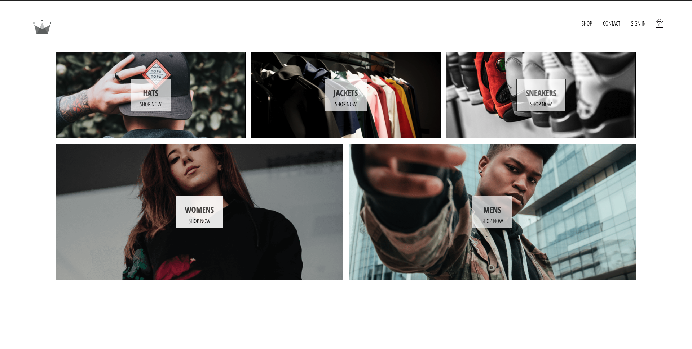

 
  <h3 align="center">Crown Clothing E-commerce</h3>

  

    Crown Clothing E-commerce Platform writing React Best Practice.
     
     
    <a href="https://angry-sammet-b6f191.netlify.app/">View Demo</a>
  

## About The Project

Simple E-commerce practise with React-Redux and use Stripe as a payment system. Use every best practise and check performance for every detail.

### Built With

For the whole project, I used following tools and language.

- [HTML]()
- [CSS Module]()
- [Javasript]()
- [Es6]()
- [React](https://reactjs.org/)
- [Redux]()
- [React-Router]()
- [Sega]()
- [Stripe]()

<!-- CONTACT -->

## Contact

👤 **KoNyan**

- Github: [GitHub](https://github.com/konyan)
- Twitter: [Twitter](https://www.linkedin.com/in/nyanlintun/)
- Linkedin: [Linkedin](https://twitter.com/devkonyan)

<!-- SUPPORT -->

## Show your support

Give a ⭐️ if you like this project!

<!-- ACKNOWLEDGEMENTS -->

## Acknowledgements

Thanks to

- [CSS Tricks](https://css-tricks.com/controlling-css-animations-transitions-javascript/)